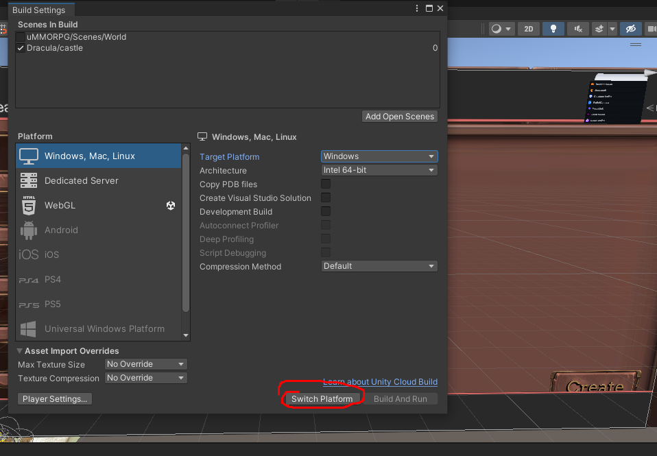
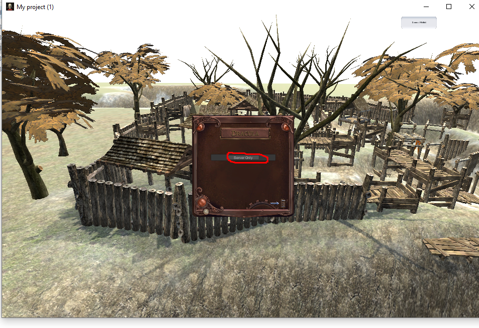
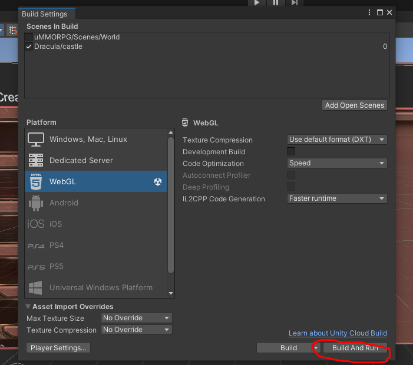
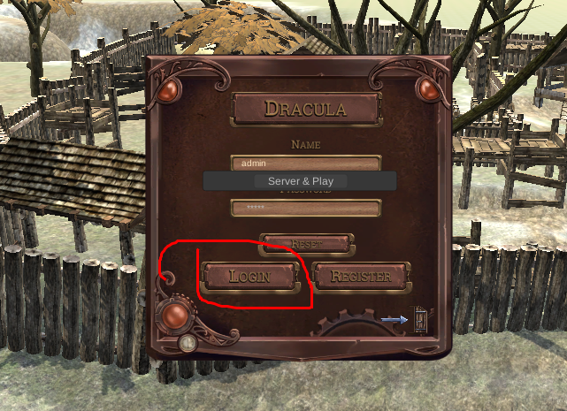

# Dracula game

**How to run Project?**

Server side:

- First you have to build server side on EXE.
-  
  
- After build, host server. 
- 
  

Client side:
- And then build and run client side.
- 
- After built, Login
- 